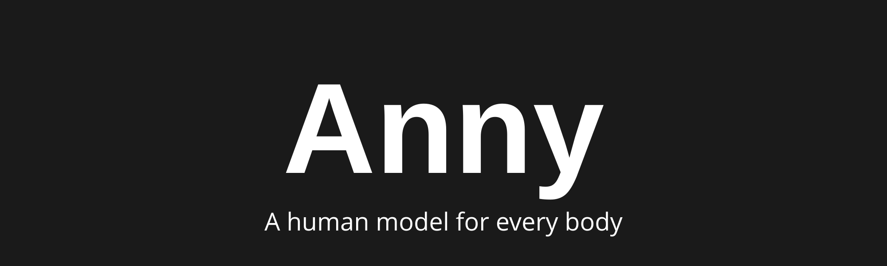

<!-- <h1 style="text-align: center;">Anny Body</h1> -->

<p align="center">
  
  
</p>

Anny is a differentiable human body mesh model written in PyTorch.
Anny models a large variety of human body shapes, from infants to elders, using a common topology and parameter space.


<p align="center">
  <a href="https://pypi.org/project/anny/"></a>
  <a href="https://opensource.org/licenses/Apache-2.0"></a>
  <a href="https://arxiv.org/abs/2511.03589"></a>
  <a href="http://anny-demo.europe.naverlabs.com/"></a>
  <a href="https://europe.naverlabs.com/blog/anny-a-free-to-use-3d-human-parametric-model-for-all-ages/"></a>
</p>

### Features
- Anny is based on the tremendous work of the [MakeHuman](https://static.makehumancommunity.org/) community, which offers plenty of opportunities for extensions.
- We provide both full body and part-specific models for hands and faces.
- Anny is open-source and free.

### News
 - **2026-08-06**: v0.6: New "anny" rig, facial actions, improved SOMA compatibility, API refactoring, and better torch.compile support. See [CHANGELOG.md](CHANGELOG.md) for more details.
 - **2026-06-03**: v0.5: code refactoring (one can now use `anny.Anny` syntax). Support for ["soma"](https://github.com/NVlabs/SOMA-X) rig and topology. SMPLX wrapper with "anny" topology support.
 - **2026-02-04**: v0.3: "smplx" topology available for interoperability with [SMPL-X](https://smpl-x.is.tue.mpg.de/) (non-commercial use only). Nipple blend shapes excluded from default settings (use `local_changes="all"` for backward compatibility).
 - **2025-11-21**: v0.2: support for different mesh topologies.
 - **2025-11-05**: v0.1: initial release.

## Installation

```bash
pip install anny[smpl,examples] # Full install (non-free dependencies).
pip install anny[examples] # Free install.
pip install anny # Minimal install.
# Note that the free install may download non-commercial only assets when needed.
pip install anny[examples]@git+https://github.com/naver/anny.git # latest sources.
```

## Quickstart example
```python
import torch, anny, trimesh
model = anny.Anny(local_changes="default", facial_actions="all").to(dtype=torch.float32)
# The model accept both dictionnary and stacked tensor inputs.
# Skeletal rig pose parameters (see model.bone_labels).
pose_parameters = torch.eye(4)[None, None].repeat(1, model.bone_count, 1, 1)
# High-level shape parameters (within [0,1], see model.phenotype_labels):
phenotype_kwargs = {key : 0.5 for key in model.phenotype_labels}
# Local shape changes (within [-1,1], see model.local_change_labels):
local_changes = {'stomach-pregnant-incr': 1.}
# Facial expression changes (within [0,1], see model.facial_action_labels):
facial_actions = {"jawOpen": 0.8, "mouthSmileLeft": 0.4}
# Export default mesh output
output = model(
      pose_parameters=pose_parameters,
      phenotype_kwargs=phenotype_kwargs,
      local_changes_kwargs=local_changes,
      facial_actions=facial_actions
      )
trimesh.Trimesh(vertices = output["vertices"].squeeze(dim=0).numpy(), faces=model.faces).export("anny_output.ply")
```

## Tutorials

To get started with Anny, you can have a look at the different tutorials in the `tutorials` directory:
- [Shape parameterization](https://naver.github.io/anny/build/shape_parameterization.html)
- [Pose parameterization](https://naver.github.io/anny/build/pose_parameterization.html)
- [Portability of pose parameterizations](https://naver.github.io/anny/build/pose_transfer.html)
- [Texture coordinates](https://naver.github.io/anny/build/texture.html)
- [Alternative models](https://naver.github.io/anny/build/alternative_models.html)

### Interactive demo

We provide a simple Gradio demo enabling to interact with the model easily:
```bash
python -m anny.examples.interactive_demo
```


### Poses, soft tissue and hair

Anny ships a pose library, corrective shapes for the joints and hair that follows the body. All of them follow the phenotype sliders:
- `anny.poses` holds 50 poses and 7 animation clips for the `anny` rig as `local-ref` pose parameters. The root offset scales with the hip height of the body, the lowest point of the posed body stands on the floor, and the seated poses come with a stool that fits the body (`anny.poses.names()` lists the entries).
- `anny.correctives.SoftTissueCorrectives(model)` adds corrective shapes at the shoulders, the elbows, the hips and the knees. A soft-tissue simulation made the shapes on the default body, and each shape scales with the size of the body around it.
- `anny.hair.StrandBinding` ties hair strands to the skin at their roots and at their tips, so a groom made on one body follows every setting of the sliders.
- `anny.utils.subdivision` holds Catmull-Clark subdivision as sparse linear operators, with a mixed subdivision that adds one level on the head.

```python
import anny, anny.poses
from anny.correctives import SoftTissueCorrectives
model = anny.Anny()
phenotype = {"age": 0.3}
posed = anny.poses.pose_parameters(model, "seated", phenotype_kwargs=phenotype)
output = model(pose_parameters=posed["pose_parameters"], phenotype_kwargs=phenotype)
output = SoftTissueCorrectives(model)(output)  # corrected output["vertices"]
```

### Face and head shapes

`anny.Anny(face_shapes="all")` adds 103 named, symmetric shapes of the head and the face, built from the MakeHuman face targets: head archetypes (oval, round, square and others), and the size, the position and the form of the eyes, the brows, the nose, the cheeks, the mouth, the chin and the ears. Ten detail shapes complete them: they are the symmetric principal components of what the named shapes miss of the 3D faces of ICT-FaceKit. Each group of shapes scales with the size of the matching part of the head, so the shapes stay in proportion on a child. `anny.faces.distribution.FaceShapeDistribution` draws face values for any age, gender, weight and muscle, from a distribution calibrated against measured faces, and `anny.faces.measurements` measures heads as the 3D Facial Norms database and the ANSUR II survey do:

```python
import anny, torch
from anny.faces.distribution import FaceShapeDistribution
from anny.faces.measurements import CraniofacialMeasurements
model = anny.Anny(face_shapes="all")
phenotype = {"age": torch.full((4,), 0.8), "gender": torch.tensor([0.0, 0.0, 1.0, 1.0])}
faces = FaceShapeDistribution(model).sample(phenotype)
output = model(phenotype_kwargs=phenotype, face_shape_kwargs=faces)
lengths = CraniofacialMeasurements(model)(output)["headlength"]  # mm
```

The calibration uses only free sources that download without an account: the ICT-FaceKit identity space, ANSUR II, the 3D Facial Norms summary statistics, the CDC growth charts, and FairFace photographs with MediaPipe for the benchmark (see `src/anny/data/faces/SOURCES.md` and `python -m anny.faces.authoring.benchmark`).

### Web viewer

`viewer/dist/anny_viewer.html` renders anny in a browser with WebGL2, from one file. It carries skin shading with subsurface scattering, eyes with a refractive cornea and about 56,000 hair strands. Its Character panel holds anny's phenotype sliders, which run from 0 to 1 with anny's default at 0.5, and the face shapes, with a Random face button that draws from the calibrated distribution. Its Pose panel plays the poses and clips of `anny.poses` with the corrective shapes. To rebuild the page (node 22 or later is needed):

```bash
uv sync --extra viewer
uv run python -m anny.viewer build
```

The build caches its slow stages, such as the bakes and the hair groom, under the cache directory (see [Caching](#caching)). For hosts that limit the size of a file, `node viewer/build.mjs --parts <dir>` also writes the page with its model data in separate text files that the page fetches next to itself. The viewer grew from an earlier stand-alone experiment, the `3D Model` folder, which git history keeps at commit `b10538d`.

## Technical details

### Default `anny` rig

By default, `anny.Anny()` uses the compact `anny` rig with 104 bones. This is the recommended default for most full-body use cases: it keeps the main body, hand, and head articulation while removing facial expression, eye, tongue, and other zero-weight/pruned bones that are present in the full MakeHuman rig. For comparison, `Anny(rig="makehuman")` exposes the full 163-bone MakeHuman rig with the old blender/root-identity orientation. Choose `rig="anny"` for a smaller, stable default skeleton; choose `rig="makehuman"` if you need exact compatibility with old models or direct access to the removed face/tongue/eye bones. Facial action blendshapes remain available separately with `facial_actions="all"`.

### Default `anny` topology

By default, `anny.Anny()` uses the `anny` topology: a MakeHuman-derived full-body mesh with Anny's minor nudity-related mesh edits, unattached vertices removed, and triangular faces. This is the recommended topology for new full-body models because every output vertex is referenced by the mesh connectivity and the triangulated faces work directly with downstream tools such as anthropometry and most mesh processing libraries. Use `topology="anny-quads"` if you need the original quad faces, `topology="anny-full"` if you need to keep unattached vertices and disable the nudity-related mesh edits, or `topology="makehuman"` for the unedited quad MakeHuman body mesh convention. Alternative retopologies such as `smplx`, `smpl`, and `soma` are available when interoperability with those ecosystems is more important than using Anny's native mesh.

### Migration from legacy defaults

`anny.Anny()` defaults to the new Anny model (`rig="anny"`, `topology="anny"`, `pose_parameterization="local-ref"`), while the deprecated `anny.create_fullbody_model(...)` factory preserves the legacy full-body defaults. If you just want the new defaults, call `anny.Anny()` directly. If you need the exact legacy behavior, either keep using `create_fullbody_model(...)` while migrating, or translate its arguments to `Anny(...)` as follows:

| Legacy `create_fullbody_model(...)` argument | Equivalent `anny.Anny(...)` argument |
|---|---|
| `rig="default"` (full 163-bone MakeHuman rig) | `rig="makehuman"` |
| `topology="default"` (with the default `triangulate_faces=False`) | `topology="anny-quads"` |
| `topology="default", triangulate_faces=True` | `topology="anny"` |
| `remove_unattached_vertices=False` | append `-full` to the topology string (e.g. `topology="anny-quads-full"`) |
| `pose_parameterization` (default `"local-bone"`) | `pose_parameterization="local-bone"`, passed explicitly (`Anny()` defaults to `"local-ref"`) |
| `all_phenotypes=True` | `phenotypes="all"` |
| `bone_orientation=...` | folded into the rig string via modifiers such as `-blender` or `-rootidentity` |

⚠️ Pose parameters are not interchangeable across pose parameterizations: pose data saved with the legacy `"local-bone"` default will not produce the same pose under the new `"local-ref"` default. Either pass `pose_parameterization="local-bone"` explicitly for compatibility, or convert existing pose data with `anny.utils.pose.transfer_pose_parameters` (see the [pose portability tutorial](https://naver.github.io/anny/build/pose_transfer.html)).

See [CHANGELOG.md](CHANGELOG.md) for the full list of changes.

### Caching

Anny parses MakeHuman assets and caches pre-computed blend shape data to avoid recomputation on subsequent runs.
The first instantiation of a model can take a few minutes. 
By default the cache is stored in `~/.cache/anny/`. To use a different location, set the `ANNY_CACHE_DIR` environment variable:

```bash
export ANNY_CACHE_DIR=/path/to/cache
```


## License

The code of Anny, Copyright (c) 2025 NAVER Corp., is licensed under the Apache License, Version 2.0 (see [LICENSE](LICENSE)).

**data/mpfb2**: *Anny* relies on [MakeHuman](https://static.makehumancommunity.org/) assets adapted from [MPFB2](https://github.com/makehumancommunity/mpfb2/) that are licensed under the [CC0 1.0 Universal](src/anny/data/mpfb2/LICENSE.md) License.

**data/faceunits01**: Facial actions of *Anny* rely on [Face Units asset pack](https://static.makehumancommunity.org/assets/assetpacks/index.html#functional-asset-packs) by Mika Suominen, licensed under the [CC0 1.0 Universal](src/anny/data/mpfb2/LICENSE.md) License.

**data/faces, data/keypoints/mediapipe.json, data/shape_calibration/face_prior.safetensors**: the face-shape distribution derives from the [ICT-FaceKit](https://github.com/USC-ICT/ICT-FaceKit) identity space (MIT licence), the ANSUR II survey (public release), the [3D Facial Norms](https://www.facebase.org/resources/human/facial_norms/) summary statistics (FaceBase; acknowledgement in `src/anny/data/faces/SOURCES.md`) and the CDC growth charts (public domain). The MediaPipe landmarks on anny derive from MediaPipe's canonical face model (Apache 2.0). No source data is redistributed.

**data/soma**: *Anny* provide a "soma" topology adapted from [SOMA-X](https://github.com/NVlabs/SOMA-X) which is licenced under the [Apache 2.0](https://github.com/NVlabs/SOMA-X/blob/main/LICENSE) license.

**smplx**: A "smplx" topology can be downloaded for non-commercial use only, allowing interoperability with [SMPL-X](https://smpl-x.is.tue.mpg.de/). See LICENSE.txt and NOTICE.txt files in http://download.europe.naverlabs.com/humans/Anny/noncommercial.zip for more information.

## Citation

```bibtex
@inproceedings{anny,
      title={Human Mesh Modeling for {A}nny {B}ody},
      author={Romain Br{\'e}gier and Gu{\'e}nol{\'e} Fiche and Laura Bravo-S{\'a}nchez and Thomas Lucas and Matthieu Armando and Philippe Weinzaepfel and Gr{\'e}gory Rogez and Fabien Baradel},
      booktitle="Computer Vision -- ECCV 2026",
      year={2026},
      publisher="Springer Nature Switzerland",
      address="Cham",
      pages="170--188",
      isbn="978-3-032-37314-4"
}
```
