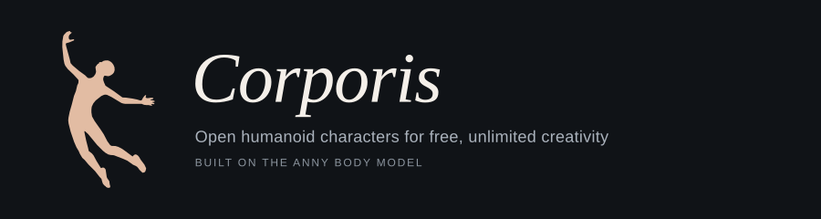

<p align="center">
  
</p>

# Corporis

[](https://github.com/infinia-yzl/anny/actions/workflows/tests.yml)

**Corporis is an open toolkit for humanoid 3D characters: a differentiable body model in PyTorch, a web viewer and a glTF export for game engines. It is built on [Anny](https://github.com/naver/anny) by NAVER LABS Europe.**

<p align="center">
  
</p>

> ## Built and maintained by AI agents
>
> AI coding agents ([Claude Code](https://claude.com/claude-code)) write and maintain everything that this repository adds to Anny. One human author ([infinia-yzl](https://github.com/infinia-yzl)) sets the goals and publishes the repository. The author has not read every line, and agents make mistakes, so review and test the code before you rely on it. The project comes **without any warranty** (see [Disclaimer](#disclaimer-and-no-warranty)).

### Credits

Corporis builds on:
- **[Anny](https://github.com/naver/anny)** by Romain Brégier, Guénolé Fiche, Laura Bravo-Sánchez, Thomas Lucas, Matthieu Armando, Philippe Weinzaepfel, Grégory Rogez and Fabien Baradel at [NAVER LABS Europe](https://europe.naverlabs.com/). The body model, its parameters, the topologies, the rigs and the `anny` package come from Anny (Apache License 2.0, Copyright (c) 2025 NAVER Corp.). If you use Corporis in research, please cite the Anny paper (see [Citation](#citation)).
- **[MakeHuman](https://static.makehumancommunity.org/)** and **[MPFB2](https://github.com/makehumancommunity/mpfb2/)**, whose CC0 assets (targets, rigs, poses and the face units of Mika Suominen) are the base of Anny.
- **[SOMA-X](https://github.com/NVlabs/SOMA-X)** (NVIDIA), for the `soma` rig and topology.
- **[ICT-FaceKit](https://github.com/USC-ICT/ICT-FaceKit)**, MediaPipe, and the datasets listed in [LICENSE_THINGS](LICENSE_THINGS) and `src/anny/data/faces/SOURCES.md`, for the face shapes.

These authors have not reviewed or endorsed Corporis.

### About the names

The `corporis` distribution holds two packages: `anny` (`src/anny`), the upstream body model, which keeps its name so that upstream updates merge cleanly, and `corporis` (`src/corporis`), with the glTF export, the pose from a picture and the `corporis` command.

### Features
- Anny's parametric body model: full body, hand and head, with 9 shape parameters (`model.phenotype_labels`).
- 103 face shapes with a random face sampler, 25 procedural hairstyles, 50 poses and 7 clips, and soft-tissue correctives.
- A web viewer with a character editor.
- Export to glTF 2.0 (`.glb`) with the skeleton, the skin weights, facial morph targets and animations (see [Export to glTF](#export-to-gltf)).
- Pose a character from a picture, and draw it flat as a silhouette, a line drawing or a toon picture (see [Pose from a picture](#pose-from-a-picture)).
- Planned: **Corpi**, a desktop companion.
- Apache License 2.0, with CC0 and other permissive data (see [LICENSE_THINGS](LICENSE_THINGS)).

### Upstream news (Anny)
 - **2026-08-06**: v0.6: New "anny" rig, facial actions, improved SOMA compatibility, API refactoring, and better torch.compile support. See [CHANGELOG.md](CHANGELOG.md) for more details.
 - **2026-06-03**: v0.5: code refactoring (one can now use `anny.Anny` syntax). Support for ["soma"](https://github.com/NVlabs/SOMA-X) rig and topology. SMPLX wrapper with "anny" topology support.
 - **2026-02-04**: v0.3: "smplx" topology available for interoperability with [SMPL-X](https://smpl-x.is.tue.mpg.de/) (non-commercial use only). Nipple blend shapes excluded from default settings (use `local_changes="all"` for backward compatibility).
 - **2025-11-21**: v0.2: support for different mesh topologies.
 - **2025-11-05**: v0.1: initial release.

## Installation

Install Corporis from this repository. It adds the viewer, the face shapes, the hair, the poses and the correctives to Anny:

```bash
pip install "corporis @ git+https://github.com/infinia-yzl/anny.git"                 # the model, the export and the corporis command
pip install "corporis[examples] @ git+https://github.com/infinia-yzl/anny.git"       # with the examples and tutorials
pip install "corporis[smpl,examples] @ git+https://github.com/infinia-yzl/anny.git"  # with the SMPL and SMPL-X wrappers (non-commercial data, see Disclaimer)
uv sync --extra examples                                                             # in a clone of this repository
```

Corporis is not on PyPI yet. Uninstall the upstream `anny` distribution first (`pip uninstall anny`), because both distributions install the `anny` package. The SMPL and SMPL-X topologies download non-commercial data on first use.

## Quickstart example
```python
import torch, anny, trimesh
model = anny.Anny(local_changes="default", facial_actions="all").to(dtype=torch.float32)
# The model accept both dictionnary and stacked tensor inputs.
# Skeletal rig pose parameters (see model.bone_labels).
pose_parameters = torch.eye(4)[None, None].repeat(1, model.bone_count, 1, 1)
# High-level shape parameters (within [0,1], see model.phenotype_labels):
phenotype_kwargs = {key : 0.5 for key in model.phenotype_labels}
# Local shape changes (within [-1,1], see model.local_change_labels):
local_changes = {'stomach-pregnant-incr': 1.}
# Facial expression changes (within [0,1], see model.facial_action_labels):
facial_actions = {"jawOpen": 0.8, "mouthSmileLeft": 0.4}
# Export default mesh output
output = model(
      pose_parameters=pose_parameters,
      phenotype_kwargs=phenotype_kwargs,
      local_changes_kwargs=local_changes,
      facial_actions=facial_actions
      )
trimesh.Trimesh(vertices = output["vertices"].squeeze(dim=0).numpy(), faces=model.faces).export("anny_output.ply")
```

## Tutorials

To get started with Anny, you can have a look at the different tutorials in the `tutorials` directory:
- [Shape parameterization](https://naver.github.io/anny/build/shape_parameterization.html)
- [Pose parameterization](https://naver.github.io/anny/build/pose_parameterization.html)
- [Portability of pose parameterizations](https://naver.github.io/anny/build/pose_transfer.html)
- [Texture coordinates](https://naver.github.io/anny/build/texture.html)
- [Alternative models](https://naver.github.io/anny/build/alternative_models.html)

### Interactive demo

We provide a simple Gradio demo enabling to interact with the model easily:
```bash
python -m anny.examples.interactive_demo
```


### Poses, soft tissue and hair

All of these follow the phenotype sliders:
- `anny.poses` holds 50 poses and 7 animation clips for the `anny` rig, standing on the floor, with a stool for the seated poses (`anny.poses.names()` lists them).
- `anny.correctives.SoftTissueCorrectives(model)` adds corrective shapes at the shoulders, the elbows, the hips and the knees.
- `anny.hair.StrandBinding` ties hair strands to the skin, so a groom follows every body.
- `anny.hair.styles` holds 25 procedural hairstyles, from buzz cuts to long hair and buns, with length, curl, volume, density and fade parameters. `anny.hair.dynamics.HairSim` simulates the hair.
- `python -m anny.hair.authoring.photos` compares the shared hairline with photos (`uv sync --extra faces`).
- `anny.utils.subdivision` holds Catmull-Clark subdivision as sparse linear operators.

```python
import anny, anny.poses
from anny.correctives import SoftTissueCorrectives
model = anny.Anny()
phenotype = {"weight": 0.3, "muscle": 0.7}
posed = anny.poses.pose_parameters(model, "seated", phenotype_kwargs=phenotype)
output = model(pose_parameters=posed["pose_parameters"], phenotype_kwargs=phenotype)
output = SoftTissueCorrectives(model)(output)  # corrected output["vertices"]
```

### Face and head shapes

`anny.Anny(face_shapes="all")` adds 103 named, symmetric shapes of the head and the face from the MakeHuman targets, and 10 detail shapes from the 3D faces of ICT-FaceKit. The shapes scale with the size of the head. `FaceShapeDistribution` draws random faces, and `CraniofacialMeasurements` measures the head mesh:

```python
import anny, torch
from anny.faces.distribution import FaceShapeDistribution
from anny.faces.measurements import CraniofacialMeasurements
model = anny.Anny(face_shapes="all")
phenotype = {"weight": torch.full((4,), 0.6), "gender": torch.tensor([0.0, 0.0, 1.0, 1.0])}
faces = FaceShapeDistribution(model).sample(phenotype)
output = model(phenotype_kwargs=phenotype, face_shape_kwargs=faces)
lengths = CraniofacialMeasurements(model)(output)["headlength"]  # mm
```

The distribution of random faces comes from fits of the face shapes to the ICT-FaceKit identity space, and it varies around anny's own face. `src/anny/data/faces/SOURCES.md` lists the data behind it and their licences, and `python -m anny.faces.authoring.benchmark` rebuilds its checks.

### Web viewer

`viewer/dist/anny_viewer.html` renders the characters in a browser with WebGL2, from one file, with skin, eye and hair shading. To rebuild the page (node 22 or later):

```bash
uv sync --extra viewer
uv run python -m anny.viewer build
```

- The **Character** segment on the left holds presets, the body sliders (the `age` parameter appears as *Form*), the 103 face shapes with a Random face button, 25 hairstyles, and the skin and eye colours.
- The **Stage** segment on the right holds the poses and clips, the rig and skin-weight views, and the lighting and quality settings.
- The camera orbits with a drag and zooms with the wheel. The `?` key lists every shortcut.
- The **Performance** card (the `` ` `` key or `?stats=1`) shows the frame times and runs a 10-second benchmark.

After a change to the page alone, `node viewer/build.mjs --reuse-data` rebuilds it in seconds. `node viewer/build.mjs --parts <dir>` writes the model data in separate files for hosts that limit the size of a file.

## Export to glTF

`corporis.export_glb` writes a character as a binary glTF 2.0 file (`.glb`), the open format that Blender, Godot, Unity, Unreal Engine and three.js import:

```python
from corporis import Character, export_glb, read_character

character = Character(name="ada", phenotype={"muscle": 0.7, "weight": 0.6}, facial_actions={"mouthSmileLeft": 0.4})
export_glb("ada.glb", character, animations=["walk", "wave", "seated"])
read_character("ada.glb")  # the same Character, from the extras of the file
```

The same export from the command line, with a character card (JSON):

```bash
corporis character > ada.json                  # a card with the default settings; edit its values
corporis export ada.glb --character ada.json --animation walk --animation wave
corporis export ada.glb --morph-targets all    # the facial actions and all 113 face shapes
corporis names poses                           # the 50 poses and 7 clips of the library
```

The file holds:
- The mesh in the rest pose of the character (13,718 Anny vertices, split into 14,898 at the UV seams), with normals and UVs, standing on the floor.
- The 104 bones of the `anny` rig as a skeleton, with the skin weights of the 4 strongest bones of each vertex (`--influences 8` adds a second set).
- Morph targets named after the 52 ARKit facial actions (`jawOpen`, `eyeBlinkLeft`, ...), and on request the face shapes (`<name>.pos` and `<name>.neg`). Sparse storage keeps them small.
- One animation for each pose or clip of `anny.poses` that you name, after one named `pose` when the character holds its own pose.
- The settings of the character in the scene `extras`, and the Anny vertex of each glTF vertex in the `_ANNY_VERTEX` attribute.

The phenotype, the local changes and the face shapes that are not morph targets are baked into the mesh and the skeleton. Axes: metres, Y up, the figure faces +Z.

Accuracy, measured against Anny's own output on the walk, run, arms-crossed and seated animations of a default character: with 4 bones per vertex, 99 % of the vertices lie within 4 mm and the worst within 17 mm, because Anny uses up to 9 bones per vertex; with 8 bones per vertex, every vertex lies within 0.2 mm. The morph targets match Anny exactly. `test/test_gltf_export.py` evaluates the file as an engine does and checks it against Anny.

Tested so far: the [Khronos glTF validator](https://github.com/KhronosGroup/glTF-Validator) reports no errors and no warnings, and three.js (r186, `GLTFLoader`) draws the skeleton, the morph targets and the animations. Blender, Godot, Unity and Unreal Engine have not been tested yet.

Not in the file yet: textures (the material is a plain skin colour), the hair, the soft-tissue correctives (the export uses plain skinning) and the eyes' shading.

## Pose from a picture

`corporis.pose_from_image` poses a character as the figure in a picture: the body, the head, the fingers and the facial expression. It reads the picture with Google's [MediaPipe](https://ai.google.dev/edge/mediapipe) pose, hand and face landmarkers, which download on first use into `ANNY_CACHE_DIR/corporis/models`.

```bash
uv sync --extra pose
corporis pose photo.jpg --card pose.json --glb pose.glb --svg pose.svg --outline pose_line.svg --png pose.png
corporis pose photo.jpg --png pose.png --view three-quarter   # the picture's camera (the default), front or three-quarter
```

```python
from corporis import Character, export_glb, pose_from_image

character = pose_from_image("photo.jpg", Character(name="ada", phenotype={"height": 0.7}))
export_glb("ada.glb", character)  # the pose becomes an animation named "pose"
```

The character card stores the pose in `pose`: a quaternion for each bone that moves (Anny's `local-ref` parameters). The face's scores become `facial_actions`, because MediaPipe and Anny use the same 52 ARKit names. `corporis.render.flat` draws any posed mesh as a silhouette SVG, an outline SVG (the contour and the lines where a limb passes in front of the body) or a flat-shaded PNG with a transparent background.

How it works: each bone turns to follow its landmarks, with hinges at the elbows, knees and finger joints, and a short optimisation then turns the torso, the collarbones and the limbs until the model's landmarks meet the picture's. A single picture fixes each limb's direction across the picture well and its depth less well: on drawn test poses, every limb comes back within 8° in the picture plane.

The viewer's Pose section offers the same step under **From a picture**. It reads the body, the head and the fingers, without the optimisation and the facial expression. It saves the pose shown as a character card or as a silhouette SVG. The picture stays in the browser, and MediaPipe's code and models load from their CDNs the first time.

## Technical details

### Default `anny` rig

By default, `anny.Anny()` uses the compact `anny` rig with 104 bones. This is the recommended default for most full-body use cases: it keeps the main body, hand, and head articulation while removing facial expression, eye, tongue, and other zero-weight/pruned bones that are present in the full MakeHuman rig. For comparison, `Anny(rig="makehuman")` exposes the full 163-bone MakeHuman rig with the old blender/root-identity orientation. Choose `rig="anny"` for a smaller, stable default skeleton; choose `rig="makehuman"` if you need exact compatibility with old models or direct access to the removed face/tongue/eye bones. Facial action blendshapes remain available separately with `facial_actions="all"`.

### Default `anny` topology

By default, `anny.Anny()` uses the `anny` topology: a MakeHuman-derived full-body mesh with Anny's minor nudity-related mesh edits, unattached vertices removed, and triangular faces. This is the recommended topology for new full-body models because every output vertex is referenced by the mesh connectivity and the triangulated faces work directly with downstream tools such as anthropometry and most mesh processing libraries. Use `topology="anny-quads"` if you need the original quad faces, `topology="anny-full"` if you need to keep unattached vertices and disable the nudity-related mesh edits, or `topology="makehuman"` for the unedited quad MakeHuman body mesh convention. Alternative retopologies such as `smplx`, `smpl`, and `soma` are available when interoperability with those ecosystems is more important than using Anny's native mesh.

### Migration from legacy defaults

`anny.Anny()` defaults to the new Anny model (`rig="anny"`, `topology="anny"`, `pose_parameterization="local-ref"`), while the deprecated `anny.create_fullbody_model(...)` factory preserves the legacy full-body defaults. If you just want the new defaults, call `anny.Anny()` directly. If you need the exact legacy behavior, either keep using `create_fullbody_model(...)` while migrating, or translate its arguments to `Anny(...)` as follows:

| Legacy `create_fullbody_model(...)` argument | Equivalent `anny.Anny(...)` argument |
|---|---|
| `rig="default"` (full 163-bone MakeHuman rig) | `rig="makehuman"` |
| `topology="default"` (with the default `triangulate_faces=False`) | `topology="anny-quads"` |
| `topology="default", triangulate_faces=True` | `topology="anny"` |
| `remove_unattached_vertices=False` | append `-full` to the topology string (e.g. `topology="anny-quads-full"`) |
| `pose_parameterization` (default `"local-bone"`) | `pose_parameterization="local-bone"`, passed explicitly (`Anny()` defaults to `"local-ref"`) |
| `all_phenotypes=True` | `phenotypes="all"` |
| `bone_orientation=...` | folded into the rig string via modifiers such as `-blender` or `-rootidentity` |

⚠️ Pose parameters are not interchangeable across pose parameterizations: pose data saved with the legacy `"local-bone"` default will not produce the same pose under the new `"local-ref"` default. Either pass `pose_parameterization="local-bone"` explicitly for compatibility, or convert existing pose data with `anny.utils.pose.transfer_pose_parameters` (see the [pose portability tutorial](https://naver.github.io/anny/build/pose_transfer.html)).

See [CHANGELOG.md](CHANGELOG.md) for the full list of changes.

### Caching

Anny parses MakeHuman assets and caches pre-computed blend shape data to avoid recomputation on subsequent runs. The first instantiation of a model can take a few minutes. By default the cache is stored in `~/.cache/anny/`. To use a different location, set the `ANNY_CACHE_DIR` environment variable:

```bash
export ANNY_CACHE_DIR=/path/to/cache
```


## License

The code of Anny, Copyright (c) 2025 NAVER Corp., and the modifications in this repository are licensed under the Apache License, Version 2.0 (see [LICENSE](LICENSE), [NOTICE](NOTICE) and [LICENSE_THINGS](LICENSE_THINGS)).

**data/mpfb2**: *Anny* relies on [MakeHuman](https://static.makehumancommunity.org/) assets adapted from [MPFB2](https://github.com/makehumancommunity/mpfb2/) that are licensed under the [CC0 1.0 Universal](src/anny/data/mpfb2/LICENSE.md) License.

**data/faceunits01**: Facial actions of *Anny* rely on [Face Units asset pack](https://static.makehumancommunity.org/assets/assetpacks/index.html#functional-asset-packs) by Mika Suominen, licensed under the [CC0 1.0 Universal](src/anny/data/mpfb2/LICENSE.md) License.

**data/faces, data/keypoints/mediapipe.json, data/shape_calibration/face_prior.safetensors**: the face-shape distribution derives from the [ICT-FaceKit](https://github.com/USC-ICT/ICT-FaceKit) identity space (MIT licence) and public measurement datasets; `src/anny/data/faces/SOURCES.md` lists each source, its licence and its acknowledgement. The MediaPipe landmarks on anny derive from MediaPipe's canonical face model (Apache 2.0). No source data is redistributed.

**data/soma**: *Anny* provide a "soma" topology adapted from [SOMA-X](https://github.com/NVlabs/SOMA-X) which is licenced under the [Apache 2.0](https://github.com/NVlabs/SOMA-X/blob/main/LICENSE) license.

**smplx**: A "smplx" topology can be downloaded for non-commercial use only, allowing interoperability with [SMPL-X](https://smpl-x.is.tue.mpg.de/). See LICENSE.txt and NOTICE.txt files in http://download.europe.naverlabs.com/humans/Anny/noncommercial.zip for more information.

## Disclaimer and no warranty

- **No warranty.** The software, the data, the viewer and the documentation are provided "AS IS", without warranty of any kind, either express or implied, including any warranty of title, non-infringement, merchantability, fitness for a particular purpose, accuracy, security or uninterrupted operation (Apache License 2.0, section 7).
- **No liability.** To the fullest extent that the law allows, the author of this repository, the AI agents that helped to write it, and the authors of the upstream works named in [Credits](#credits) are not liable for any damage, loss or claim that arises from the use of, or the inability to use, this project. That covers direct, indirect, incidental, special and consequential damages, including lost data, lost profit and business interruption (Apache License 2.0, section 8).
- **AI-written work.** The author does not guarantee that the code, the data or the documentation is correct, original, secure or free of third-party rights. Review and test them for your own purpose.
- **Model numbers only.** Sizes, volumes and masses describe a 3D model. Do not rely on them for medical, safety-critical, legal or identity decisions.
- **Third-party assets.** Bundled and downloaded data keep their own licences (see [LICENSE_THINGS](LICENSE_THINGS)), and the SMPL and SMPL-X data is for non-commercial use only. Check that the licences fit your use.
- **Your content.** You are responsible for the characters, images and products that you create, and for following the laws that apply to you.
- **No affiliation.** Corporis is not affiliated with, endorsed by or sponsored by NAVER, MakeHuman, NVIDIA, Anthropic or the other parties named here. Their names and marks belong to their owners.
- **Not legal advice.** This section does not change the [Apache License 2.0](LICENSE), and the license text applies where the two differ. Some rights cannot be excluded by contract in some countries.

## Citation

If you use the body model in research, please cite the Anny paper:

```bibtex
@inproceedings{anny,
      title={Human Mesh Modeling for {A}nny {B}ody},
      author={Romain Br{\'e}gier and Gu{\'e}nol{\'e} Fiche and Laura Bravo-S{\'a}nchez and Thomas Lucas and Matthieu Armando and Philippe Weinzaepfel and Gr{\'e}gory Rogez and Fabien Baradel},
      booktitle="Computer Vision -- ECCV 2026",
      year={2026},
      publisher="Springer Nature Switzerland",
      address="Cham",
      pages="170--188",
      isbn="978-3-032-37314-4"
}
```
